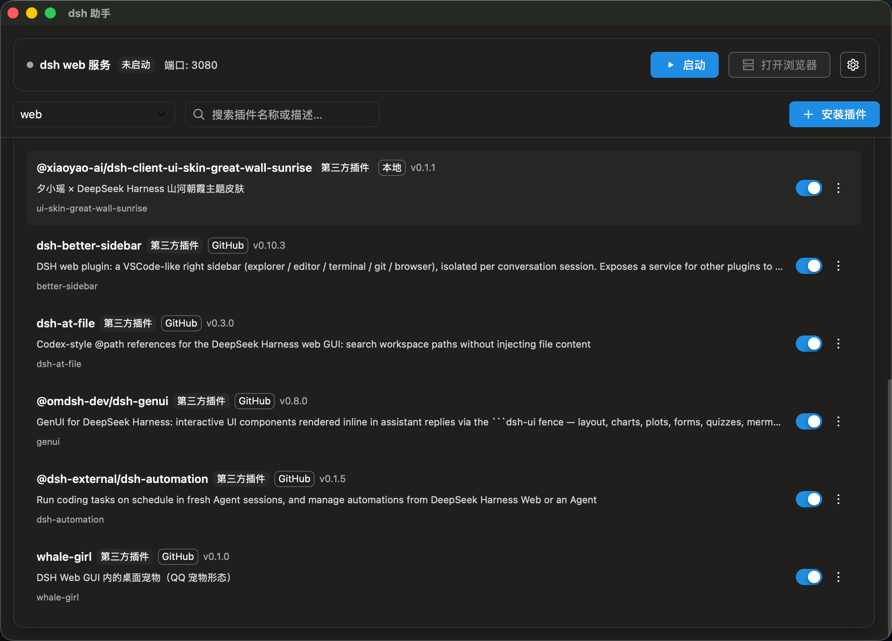
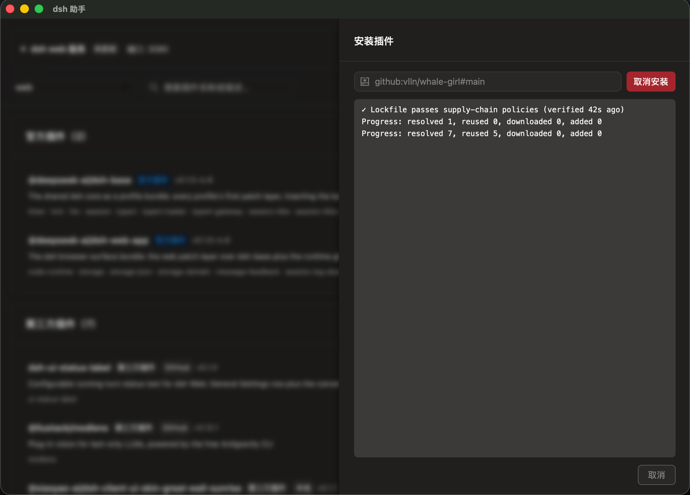
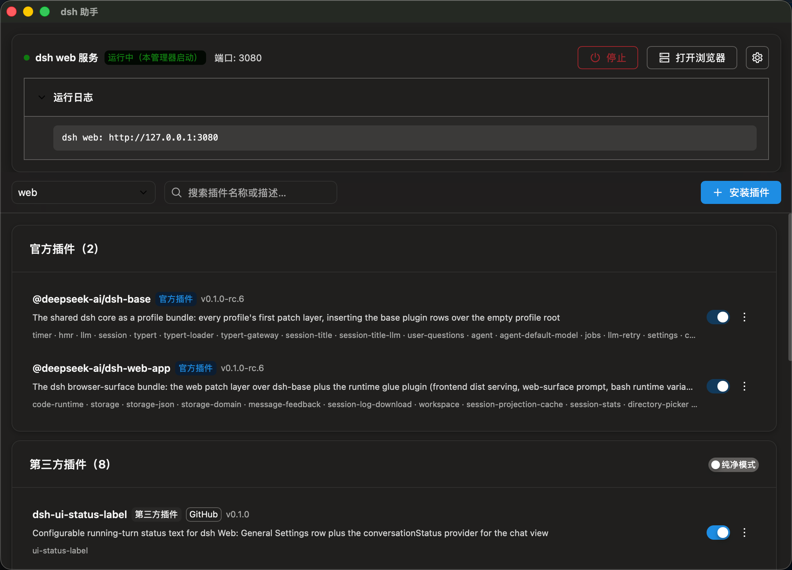
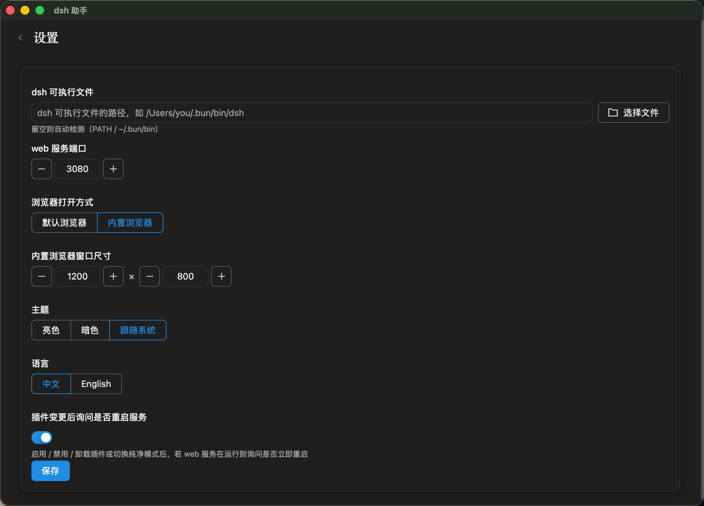

# DSH 插件管理器

基于 **Wails v3**（Go + Vue 3 / TDesign）的 dsh（DeepSeek Harness）插件管理器桌面应用。按 profile 管理 dsh 插件的启用 /
禁用、安装 / 移除、拖拽排序、纯净模式、dsh web 服务启停、插件 config 编辑、profile 视图导入导出、检查更新。

## 界面预览

| 插件列表（官方 / 第三方分组 · 搜索 · 纯净模式） | 安装插件（粘贴 spec · 实时彩色日志 · 可取消） |
|-------------------------------------------------|-----------------------------------------------|
|          |  |

| dsh web 服务一键启停                   | 设置（路径 / 端口 / 浏览器 / 主题 / 语言） |
|----------------------------------------|--------------------------------------------|
|  |     |

未安装 dsh 时自动进入全屏引导页（bun / npm 一键安装 + 重新检测）；菜单栏托盘常驻，关窗不退出，随时启停服务或唤回窗口。

## 技术栈

- **后端**：Go + Wails v3（`services/`：DshService / ProcService / FileService / KVService）
- **前端**：Vue 3 + TDesign + Vite + UnoCSS（`frontend/`）
- **原生能力**：Wails runtime（对话框 / 剪贴板 / 打开外链 / 事件系统）

## 下载

『来自123云盘VIP会员落雨不悔的分享』dsh-plugin-manager

链接：https://1842912324.share.123pan.cn/123pan/JK0UTd-Bvvxd?pwd=8zdc#

提取码：8zdc

## 开发

前置要求：Go 1.24+、Node/pnpm、`wails3` CLI（`go install github.com/wailsapp/wails/v3/cmd/wails3@latest`）。

```bash
wails3 dev      # 开发模式（vite 热更新 + Go 热重载）
wails3 build    # 生产构建，产物 bin/dsh-plugin-manager
```

改动 Go 服务后重跑 `wails3 generate bindings` 刷新前端绑定。

前端单独校验（RL-07，仅 typecheck）：

```bash
cd frontend && pnpm install && pnpm check
```

## 目录结构

```
├── main.go                  # Wails 入口（embed frontend/dist + 服务注册 + 窗口）
├── services/                # Go 服务绑定（dsh 生态 / 进程 / 文件 / KV 存储）
├── build/                   # 打包资源与平台构建任务
├── config.yml / Taskfile.yml
└── frontend/                # Vue 前端（含 wails3 生成的 bindings/）
```

详细技术文档见 [docs/01-plugin-manager.md](docs/01-plugin-manager.md)。
